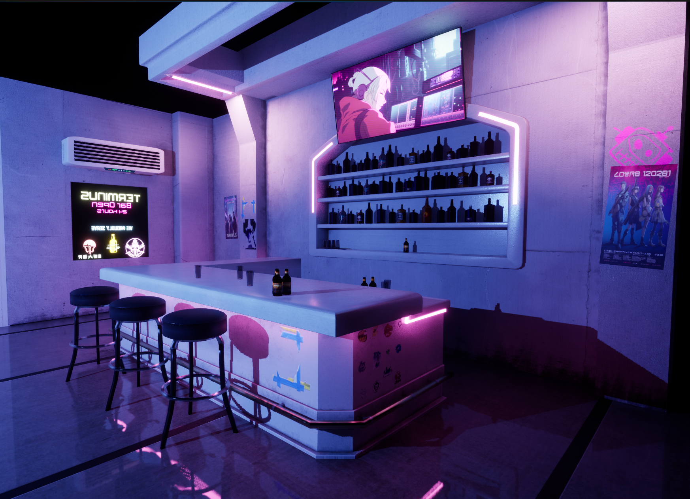

# Portfolio
Below are things I've worked on and things I'm currently working on. I'm a software engineer by trade, and a hobbyist game developer and modder.

## Starfield Mods
I actually began creating mods in Creation Engine for Starfield, and then later on doing my own mods for Skyrim and Fallout 4. As of writing this there's no Creation Kit for Starfield so a lot of these mods are limited to recolors of existing items in the game.

## In progress
### Neo-noir Quest Mod
This mod will be a multi-chapter storyline, where each chapter ends neatly but the B-plot will continue throughout the chapters. The story will follow a detective by the name of Nolan Cross who is investigating a series of crimes that may be linked to the disappearance of his husband.

The first chapter will have Nolan reluctantly getting into investigation work again. He's approached by Jimmy, a member of a local Neon band who is trying to find his bandmates who have disappeared. Nolan gave up detective work, but the description of the disappearing band is eerily similar to that of his husbands. The player will explore the past of both Jimmy and Nolan. They will find out why Nolan doesn't want to be a detective anymore, and how Jimmy has struggled with aurora.

Terminus, the new location it will be bringing to the city of Neon will serve as a usual haunt for the characters as well as its own atmospheric addition to the game. Music composed for the bar will be played there and I hope players will find it a nice place to hang out. Terminus is being hand built in Blender and will contain brand new assets to Starfield as well as some base assets to help ensure it fits in the universe.

It will feature:
- Terminus, a new bar in Neon. It will be a custom made interior with a mix of Starfield assets and hand built assets.
- Fully voice acted
- Music composed specifically for the questline
- A full story plot that ties up nicely at the end of Act 1 as well as a B plot which will continue throuhhout the chapters

Here's a *very* early look at the bar in Terminus rendered in Unreal Engine.

### Mod Template
Not a mod but may help you structure your mods as you work on them. It's meant to be used with Spriggit and BSArch. It contains scripts to pack/unpack your archives and ESPs into their loose files/YAML respectively, build for releases and snapshots etc.

I'll continue to update it as needs arise. You can find it here: [creation-mod-template](https://github.com/yak3d/creation-mod-template)

## Released
- [Operative Suit - Green Recolor](https://www.nexusmods.com/starfield/mods/3796?tab=description)
- [Operative Helmet - Green Visor](https://www.nexusmods.com/starfield/mods/3674)
- [Operative Helmet - Blacked Out](https://www.nexusmods.com/starfield/mods/3720)
- [Operative Helmet - Silver Visor](https://www.nexusmods.com/starfield/mods/3580)
- [Shocktrooper Helmet - Silver Visor](https://www.nexusmods.com/starfield/mods/3421)
- [Shocktrooper Helmet - Gold Visor](https://www.nexusmods.com/starfield/mods/3322)
- [Operative Helmet - Teal Visor](https://www.nexusmods.com/starfield/mods/3187)
- [Operative Helmet - Gold Visor](https://www.nexusmods.com/starfield/mods/3189)
- [Operative Helmet - Purple Visor](https://www.nexusmods.com/starfield/mods/3182)
- [Operative Helmet - Blue Visor](https://www.nexusmods.com/starfield/mods/2988)
- [Ace of Spades Fire Audio for the Razorback](https://www.nexusmods.com/starfield/mods/2760)
- [Malorian (Silverhand's Gun) Urban Eagle](https://www.nexusmods.com/starfield/mods/2561)
